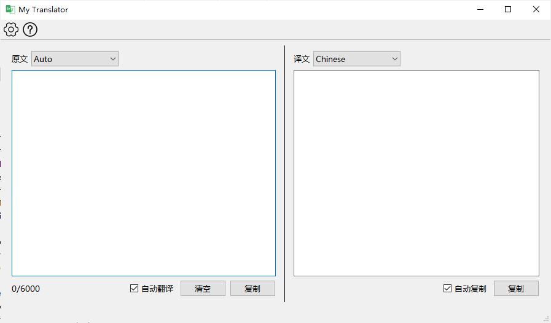
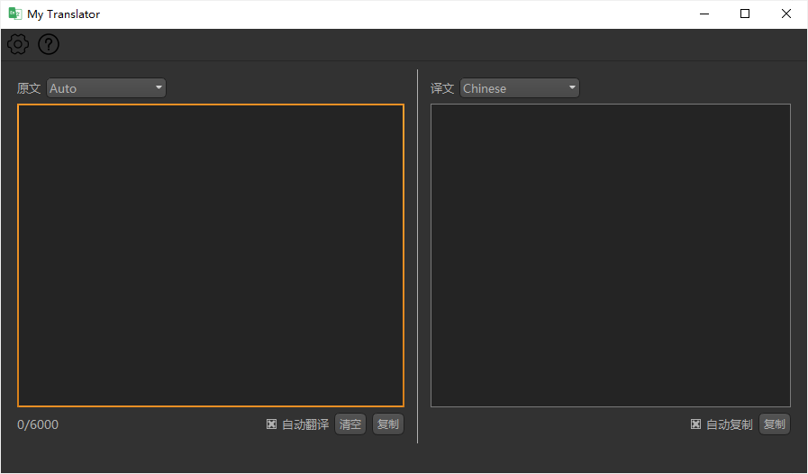
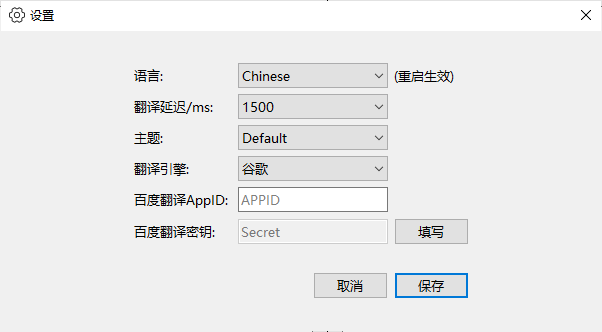

# MyTranslator

## 介绍

这是一款致力于**简洁**和**人性化**的的翻译器。

### 简洁

主界面：

黑暗主题界面：

设置窗口：

### 人性化

- 原文 1.5s 自动翻译（仍提供了按钮点击翻译）
- 自动复制译文（仍提供了按钮点击复制）
- 多种不同的主题风格，夜间使用不伤眼
- 按钮点击清空输入
- 可选择的翻译引擎
- 本地加密保存密钥
- ... ...

## 技术

使用了基于 Python 3.7 的 PyQt 5 构建界面程序，主题风格使用 QSS 定义。
